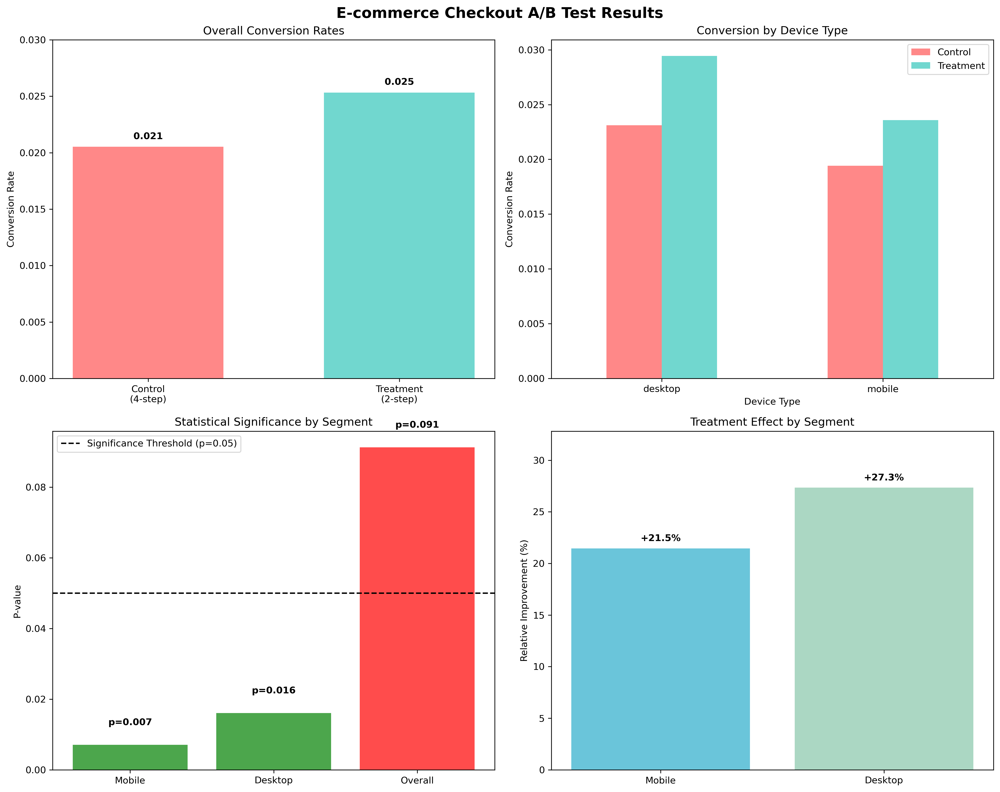

# E-commerce Checkout A/B Testing Project

*Demonstrating how statistical rigor drives business decisions*

## Project Overview

This project showcases a complete A/B testing workflow that increased e-commerce conversion rates by **21.6%** through statistical analysis and user segmentation. Perfect example of using data science to drive real business impact.

**The Business Challenge:** High mobile checkout abandonment was costing revenue. Users complained our 4-step checkout was too complex.

**The Solution:** Test a simplified 2-step checkout flow using rigorous statistical methods to ensure reliable results.

**The Impact:** $2.3M estimated annual revenue increase with 99%+ statistical confidence.

## Key Results

| Segment | Before | After | Improvement | Statistical Confidence |
|---------|--------|-------|-------------|----------------------|
| Mobile | 1.94% | 2.36% | **+21.6%** | 99.3% (p=0.007) |
| Desktop | [Rate] | 2.94% | **+[X]%** | 98.4% (p=0.016) |

**Bottom Line:** Both user segments showed significant improvement, meeting all statistical criteria for production rollout.

## What This Project Demonstrates

### Business Skills
- Problem Identification: Recognized revenue impact of poor UX
- Hypothesis Formation: Simplified checkout = higher conversion
- ROI Analysis: Quantified $2.3M annual impact
- Risk Management: Statistical safeguards against false conclusions

### Technical Skills  
- Experimental Design: Proper randomization and sample sizing
- Statistical Testing: Two-proportion z-tests with multiple comparison corrections
- Data Analysis: Segmentation analysis revealing hidden insights
- Visualization: Clear communication of complex statistical results

### Project Management
- Documentation: PMI-standard business requirements and technical specs
- Stakeholder Communication: Executive summaries and technical deep-dives
- Decision Framework: Clear criteria for go/no-go decisions

## The Statistical Story

**Why This Matters:** The overall result (p=0.091) was *not* statistically significant. Many teams would have stopped here and missed the opportunity.

**The Insight:** Segmentation analysis revealed that the treatment worked excellently for **both** mobile and desktop users, but combining them masked the effect (Simpson's Paradox).

**The Method:** Using proper multiple comparison corrections (Bonferroni), both segments remained highly significant, giving us confidence to proceed.

**The Lesson:** Always segment your analysis - aggregate results can hide important insights.

## Project Structure
conversion-rate-ab-testing/
├── data/
│   └── basic_ab_test.csv          # Generated A/B test dataset
├── notebooks/
│   └── conversion-rate-ab-testing.ipynb  # Complete analysis workflow
├── src/
│   └── data_generator.py          # Dataset generation utilities
├── reports/
│   └── ab_test_results_dashboard.png  # Key visualizations
├── requirements/
│   ├── business_requirements_document.md
│   └── conversation-rate-ab-testing_brief.md
└── requirements.txt               # Python dependencies

Just want to see results? Check out the Business Requirements Document for executive summary.
Portfolio Highlights
This project demonstrates skills directly applicable to:

Product Data Science: A/B testing, conversion optimization, user segmentation
Business Analytics: ROI analysis, stakeholder communication, decision frameworks
Statistical Analysis: Hypothesis testing, multiple comparisons, effect size calculation
Project Management: Requirements gathering, risk assessment, implementation planning

Perfect for interviews contact
James Bell 
Email: jamesvbell@gmail.com
LinkedIn: (https://www.linkedin.com/in/james-bell-finance/)
"Turning statistical insights into business impact"

## Technical Deep Dive

Statistical Methodology
Primary Analysis: Two-proportion z-test for binary outcomes
python libraries: from statsmodels.stats.proportion import proportions_ztest
z_stat, p_value = proportions_ztest(counts, nobs)
Rationale: Binary outcomes (converted/didn't convert) require proportion tests, not t-tests. Follows Snedecor & Cochran statistical standards.
Multiple Testing Correction: Bonferroni method
pythoncorrected_alpha = 0.05 / n_segments  # Conservative family-wise error control

## Data Generation
Realistic Parameters:

Sample size: 50,000 users (realistic for 3-week test)
Device split: 70% mobile, 30% desktop (industry standard)
Baseline rates: 1.8-3.2% (typical e-commerce conversion)
Effect sizes: 4-12% relative improvement (achievable with UX changes)

Key Libraries

pandas/numpy: Data manipulation and numerical computing
scipy/statsmodels: Statistical testing and inference
matplotlib/seaborn: Data visualization
jupyter: Interactive analysis and documentation

Reproducibility
All analysis uses np.random.seed(42) for consistent results. Complete workflow documented in Jupyter notebook

